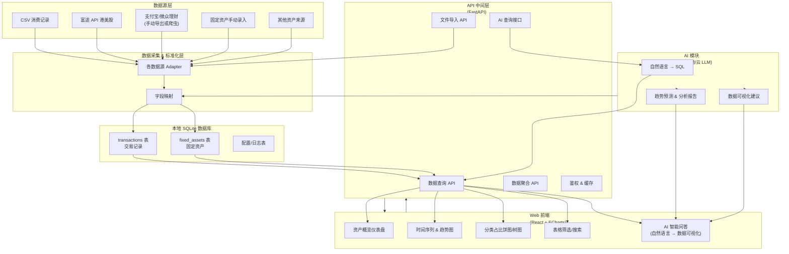

# 财务可视化管理工具

一个现代化的财务数据管理和可视化平台，支持 CSV 数据导入、多维度数据分析和图表展示。

## 📊 系统架构图



## 📊 功能特性

### 数据管理

- ✅ CSV 文件导入
- ✅ 自动数据验证
- ✅ 数据库存储
- ✅ 数据备份与恢复

### 数据分析

- ✅ 月度收支分析
- ✅ 年度对比分析
- ✅ 类别趋势分析
- ✅ 支出排行榜
- ✅ 结余趋势分析

### 数据可视化

- 📊 收支趋势图表
- 📈 类别对比图表
- 🥧 支出分布饼图
- 📉 结余变化曲线
- 📋 数据汇总表格

## 🏗️ 项目结构

```
visualize-balance-management-tool/
├── frontend/                    # React前端应用
│   ├── src/
│   │   ├── components/         # 可复用组件
│   │   ├── pages/             # 页面组件
│   │   ├── services/          # API服务
│   │   ├── hooks/             # 自定义Hooks
│   │   ├── contexts/          # React上下文
│   │   ├── utils/             # 工具函数
│   │   └── styles/            # 样式文件
│   ├── public/                # 静态资源
│   └── package.json           # 依赖配置
│
├── backend/                     # Python后端应用
│   ├── app/
│   │   ├── api/               # API路由
│   │   ├── models/            # 数据模型
│   │   ├── services/          # 业务逻辑
│   │   ├── database/          # 数据库配置
│   │   └── utils/             # 工具函数
│   ├── scripts/               # 辅助脚本
│   ├── tests/                 # 测试文件
│   ├── main.py                # 应用入口
│   └── requirements.txt       # Python依赖
│
├── dataset.csv                  # 示例数据文件
├── start.sh                    # 快速启动脚本
├── docker-compose.yml          # Docker编排文件
└── README.md                   # 项目说明
```

## 🎯 API 端点

### 财务记录查询

- `GET /api/v1/records` - 获取所有记录（分页）
- `GET /api/v1/records/year/{year}` - 按年份查询
- `GET /api/v1/records/range` - 按日期范围查询

### 数据分析

- `GET /api/v1/analysis/category-trends/{category}` - 类别趋势
- `GET /api/v1/analysis/monthly-breakdown/{month_date}` - 月度分解
- `GET /api/v1/analysis/year-comparison` - 年度对比
- `GET /api/v1/analysis/top-expenses` - 支出排行
- `GET /api/v1/analysis/balance-trend` - 结余趋势

## 🚦 快速开始

### 方式一：使用启动脚本（推荐）

```bash
# 克隆项目
git clone <repository-url>
cd visualize-balance-management-tool

# 一键启动
./start.sh
```

### 方式二：手动启动

#### 后端设置

```bash
cd backend

# 创建虚拟环境
python3 -m venv venv
source venv/bin/activate  # Windows: venv\Scripts\activate

# 安装依赖
pip install -r requirements.txt

# 导入示例数据（可选）
python scripts/import_transaction_data.py ../dataset.csv

# 启动后端服务
python main.py
```

#### 前端设置

```bash
cd frontend

# 安装依赖
npm install

# 启动开发服务器
npm run dev
```

## 📈 数据格式

CSV 文件应包含以下列（按顺序）：

1. **月度** - 日期格式：YYYY/M/D
2. **住房** - 住房支出
3. **餐饮** - 餐饮支出
4. **生活** - 生活支出
5. **娱乐** - 娱乐支出
6. **交通** - 交通支出
7. **旅行** - 旅行支出
8. **礼物** - 礼物支出
9. **交易** - 交易收入/支出
10. **人情** - 人情支出
11. **工资** - 工资收入
12. **结余** - 月度结余
13. **均匀消费支出** - 房租均摊
14. **近三月均匀消费支出** - 近期平均支出

## 📝 开发指南

### 添加新的 API 端点

1. 在 `backend/app/models/` 中定义数据模型
2. 在 `backend/app/services/` 中实现业务逻辑
3. 在 `backend/app/schemas.py` 中定义 Pydantic 模型
4. 在 `backend/app/api/routes.py` 中添加路由
5. 在 `frontend/src/services/api.js` 中添加 API 调用
6. 在 `frontend/src/hooks/useApi.js` 中创建 Hook

### 添加新的图表组件

1. 在 `frontend/src/components/` 中创建图表组件
2. 使用 Chart.js 和 react-chartjs-2
3. 在页面中引入并使用组件

## 📄 许可证

MIT License - 详见 [LICENSE](LICENSE) 文件

## 🤝 贡献

欢迎提交 Issue 和 Pull Request！

1. Fork 项目
2. 创建功能分支 (`git checkout -b feature/AmazingFeature`)
3. 提交更改 (`git commit -m 'Add some AmazingFeature'`)
4. 推送到分支 (`git push origin feature/AmazingFeature`)
5. 打开 Pull Request

---

⭐ 如果这个项目对你有帮助，请给它一个星标！
