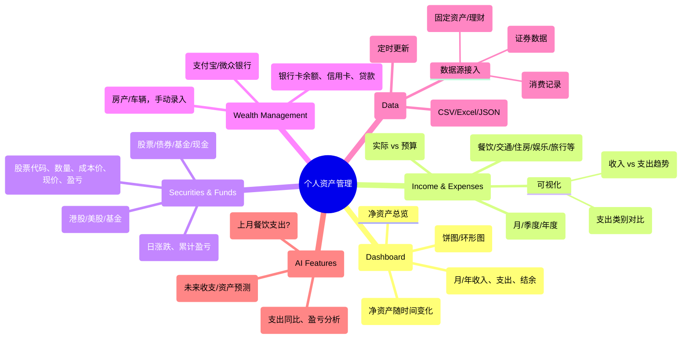
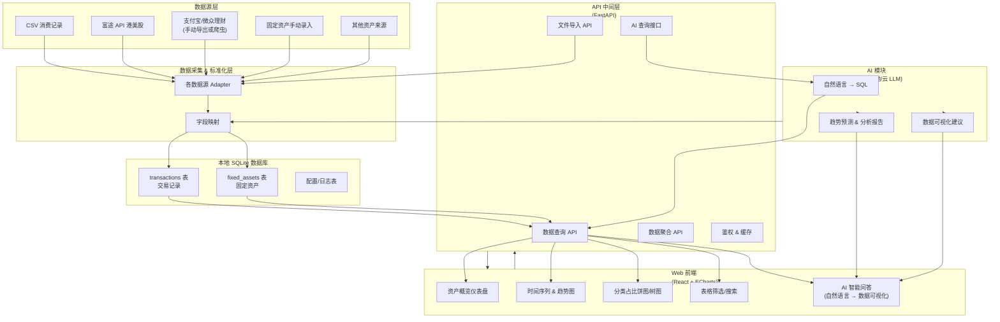

# 财务可视化管理工具

一个现代化的财务数据管理和可视化平台，支持 CSV 数据导入、多维度数据分析和图表展示。

## 📊 系统功能表



## 📊 系统架构图



## 📊 功能特性

### 核心功能模块

#### 💰 现金流分析 (Cash Flow Analysis)

- ✅ **交易记录管理**：支持交易明细的增删改查
- ✅ **多维度筛选**：按日期、类别、金额、支付方式等条件筛选
- ✅ **数据导入导出**：支持 CSV 格式的批量导入和导出
- ✅ **收支分析**：月度/年度收入支出统计和趋势分析
- ✅ **分类统计**：按消费类别（餐饮、交通、住房等）进行统计分析

#### 📊 资产负债表 (Balance Sheet)

- ✅ **资产管理**：支持各类资产的记录和管理
- ✅ **负债管理**：支持负债信息的录入和跟踪
- ✅ **净资产计算**：自动计算净资产和资产分布
- ✅ **可视化展示**：资产分布饼图、净资产趋势图

## 📋 API 接口文档

> 📖 详细 API 文档请访问：`http://localhost:8000/docs` (Swagger UI)

## 🚦 快速开始

### 系统要求

- **Node.js**: 18.0+
- **Python**: 3.11+
- **Conda**: 推荐使用 (也可使用 pip + venv)

### 方式一：使用启动脚本（推荐）

```bash
# 克隆项目
git clone <repository-url>
cd visualize-balance-management-tool

# 一键启动（自动创建conda环境并启动前后端）
chmod +x start.sh
./start.sh
```

启动脚本会自动：

- 创建并激活 conda 环境 `financial-tool`
- 安装 Python 依赖
- 安装 Node.js 依赖
- 启动后端服务 (端口 8000)
- 启动前端服务 (端口 5173)

### 方式二：手动启动

#### 后端设置

```bash
cd backend

# 方法1: 使用conda (推荐)
conda create -n financial-tool python=3.11
conda activate financial-tool
pip install -r requirements.txt

# 方法2: 使用venv
python3 -m venv venv
source venv/bin/activate  # Windows: venv\Scripts\activate
pip install -r requirements.txt

# 导入示例数据（可选）
python scripts/import_transaction_data.py data/financial_flow.csv

# 启动后端服务
python main.py
# 服务地址: http://localhost:8000
# API文档: http://localhost:8000/docs
```

#### 前端设置

```bash
cd frontend

# 安装依赖
npm install

# 启动开发服务器
npm run dev
# 访问地址: http://localhost:5173
```

### 🔗 访问地址

- **前端应用**: http://localhost:5173
- **后端 API**: http://localhost:8000
- **API 文档**: http://localhost:8000/docs
- **健康检查**: http://localhost:8000/api/v1/health

### 📊 页面功能

1. **现金流分析** (`/cash-flow`)

   - 收支趋势图表
   - 分类支出分析
   - 数据筛选和导入导出

2. **资产负债表** (`/balance-sheet`)
   - 资产管理
   - 负债管理
   - 净资产可视化

## 📈 数据格式

### CSV 导入格式

包含以下字段：

- **日期** (transaction_date) - 格式：YYYY-MM-DD
- **金额** (amount) - 数值格式，支持负数
- **类别** (category) - 如：餐饮、交通、住房、娱乐等
- **描述** (description) - 交易描述
- **收支类型** (income_expense_type) - 收入/支出
- **支付方式** (payment_method) - 支付宝、微信支付等
- **交易对手** (counterparty) - 商户或个人名称

### 数据导入功能

- ✅ **自动去重**：避免重复导入相同交易
- ✅ **数据验证**：自动检查数据格式和完整性
- ✅ **错误提示**：详细的导入错误信息
- ✅ **模板下载**：提供标准 CSV 模板下载
- ✅ **批量导入**：支持大量数据的批量处理

### 示例数据

导入功能提供了模板 csv，可作为参考。

更丰富导详细的账单自动化导入，请移步我的另一个项目 [auto-bookkeeping](https://github.com/realDuang/auto-bookkeeping)

## � 开发状态

### ✅ 已完成功能

- [x] 基础项目架构搭建
- [x] 后端 API 服务 (FastAPI)
- [x] 前端界面框架 (React + TypeScript)
- [x] 数据库设计和 ORM (SQLAlchemy)
- [x] 交易记录 CRUD 操作
- [x] 资产负债表管理
- [x] CSV 数据导入导出
- [x] 基础数据可视化图表
- [x] 响应式界面设计
- [x] API 文档生成

### 🔄 进行中功能

- [ ] 高级数据筛选和搜索
- [ ] 更多图表类型和交互功能
- [ ] 数据聚合和统计分析优化
- [ ] 用户体验改进

### 📋 待开发功能

- [ ] **投资账户管理**：股票、基金等投资数据
- [ ] **预算管理**：设置和跟踪预算目标
- [ ] **定期报告**：自动生成财务分析报告
- [ ] **数据备份**：自动数据备份和恢复
- [ ] **多用户支持**：用户认证和数据隔离
- [ ] **移动端适配**：PWA 支持
- [ ] **AI 功能**：智能分类和趋势预测
- [ ] **第三方集成**：银行 API、记账软件同步

## 🐛 已知问题

- CSV 导入时的中文编码兼容性需要改进
- 大数据量时的前端性能优化
- 某些图表在小屏幕设备上的显示效果

## 🤝 贡献

欢迎提交 Issue 和 Pull Request！

1. Fork 项目
2. 创建功能分支 (`git checkout -b feature/AmazingFeature`)
3. 提交更改 (`git commit -m 'Add some AmazingFeature'`)
4. 推送到分支 (`git push origin feature/AmazingFeature`)
5. 打开 Pull Request

---

⭐ 如果这个项目对你有帮助，请给它一个星标！
